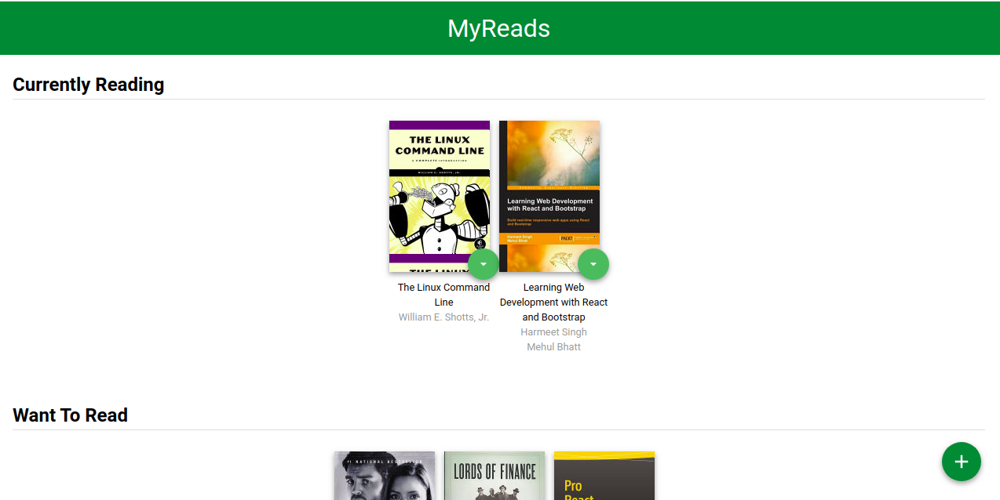
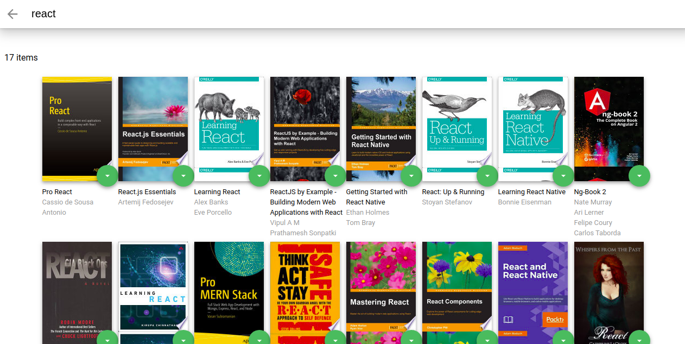

# MyReads Project

This project is part of udacity's react nanodegree program, In this we have books database from which we can search for any book and add that book to one of three catagories which is currently reading books, want to read & read, and we can also manipulate book from one catagory to another according to reading preferences.

## To get started 

Clone the app
to install dependencies use command npm install
to start development server use command npm start

## Images

